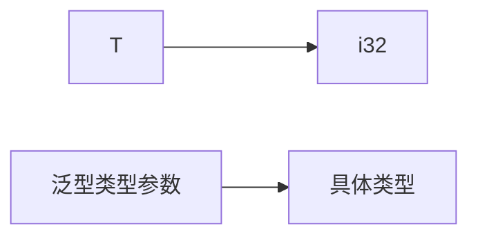
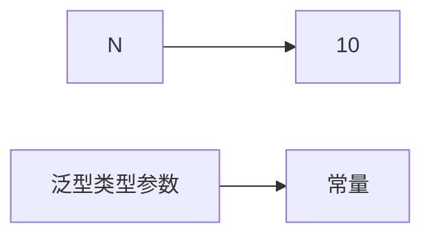

Tags: 进阶语法

# 泛型基础

泛型具有零成本的抽象，也就是说在使用泛型的时候完全不需要考虑性能问题。

Rust 是在编译期为泛型对应的多个类型（单态化），生成各自的代码，因此损失了编译速度和增大了最终生成文件的大小。

## 基础使用

泛型可以在结构体、方法、trait等地方使用

在结构体中使用泛型:

```rust
struct Point<T> {
    x: T,
    y: T,
}

let int_point = Point { x: 1, y: 2 };
let float_point = Point { x: 1.0, y: 2.0 };

```

在函数中使用泛型:

```rust
fn print<T>(t: T) {
    println!("{}", t);
}

print(1);
print("hello");

```

在trait中使用泛型:

```rust
trait Print {
    fn print(&self, t: T);
}

structPrinter;

impl Print for Printer {
    fn print<T>(&self, t: T) {
// 打印实现
    }
}

```

实现trait时使用泛型:

```rust
rustCopy codestruct Circle {
// ...
}

// 为Circle实现Summary trait
impl Summary for Circle {
// 泛型T
    fn summarize<T>(&self, item: &T) {
// 实现
    }
}
```

**为具体的泛型类型实现方法**

对于 `Point<T>` 类型，你不仅能定义基于 `T` 的方法，还能针对特定的具体类型，进行方法定义：

```rust

impl Point<f32> {
    fn distance_from_origin(&self) -> f32 {
        (self.x.powi(2) + self.y.powi(2)).sqrt()
    }
}
```

## Trait Bounds

指在使用泛型类型参数的同时对参数的Trait、类型等进行限制的行为

如：

```jsx
// T必须实现Display traits
struct Printable<T: Display> {
    data: T,
}

impl<T: Display> Printable<T> {
    // 省略方法实现
}
```

中的Display就是Trait bounds

# Const 泛型

> 在之前的泛型中，可以抽象为一句话：针对类型实现的泛型，所有的泛型都是为了抽象不同的类型，那有没有针对值的泛型？
> 

******************之前的泛型******************

签名：

```rust
*struct* TryGenerics<T: fmt::Debug>
impl<T: fmt::Debug> TryGenerics<T> 
    fn new(data: T) -> Self 
```

实例：

```rust
*let* a: TryGenerics<i32> = TryGenerics::new(1); 
```

i32填补了T的位置



********************const 泛型********************

可以让常量作为泛型参数

```rust
fn foo<const N: usize>(arr: [i32; N]) {
  // ...
}

foo::<10>([1, 2, 3, 4, 5, 6, 7, 8, 9, 10]);
```



****************const 泛型的能力****************

通过const泛型,我们可以:

1. 定义接收常量作为参数的泛型类型和函数
2. 在泛型代码中使用这些常量参数进行运算
3. 利用编译器进行常量传播和优化

所以,可以说const泛型的主要功能就是将编译时常量引入泛型系统中,以泛型参数的形式支持使用常量。

## Const 泛型表达式

# 特征对象