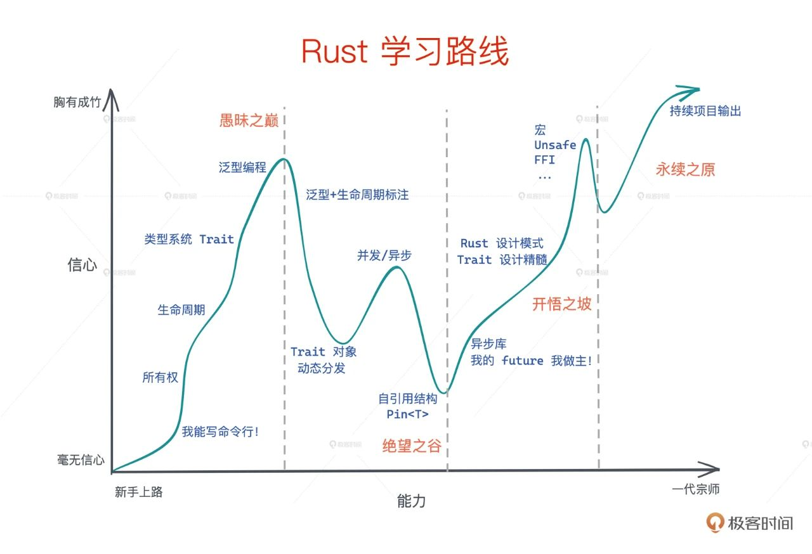

Tags: 指南

虽然建议养成搜索的习惯，但是放一下rust的官网

[Rust 程序设计语言](https://www.rust-lang.org/zh-CN/)

里面的安装和学习部分写的很明白

<!-- ![[Untitled 1.png]] -->

# 教材

Rust权威指南必备

Rustlings必备练习题

Rust Course（Rust圣经）推荐进阶使用

youtube上的Let’s get rusty做了全套的Rust权威指南视频教程，非常好使

学习方向具体看：

[全知识点目录](./全知识点目录.md)